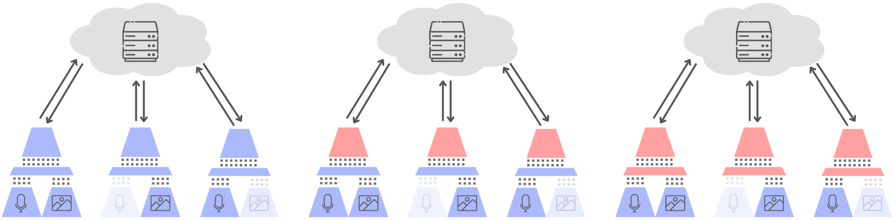
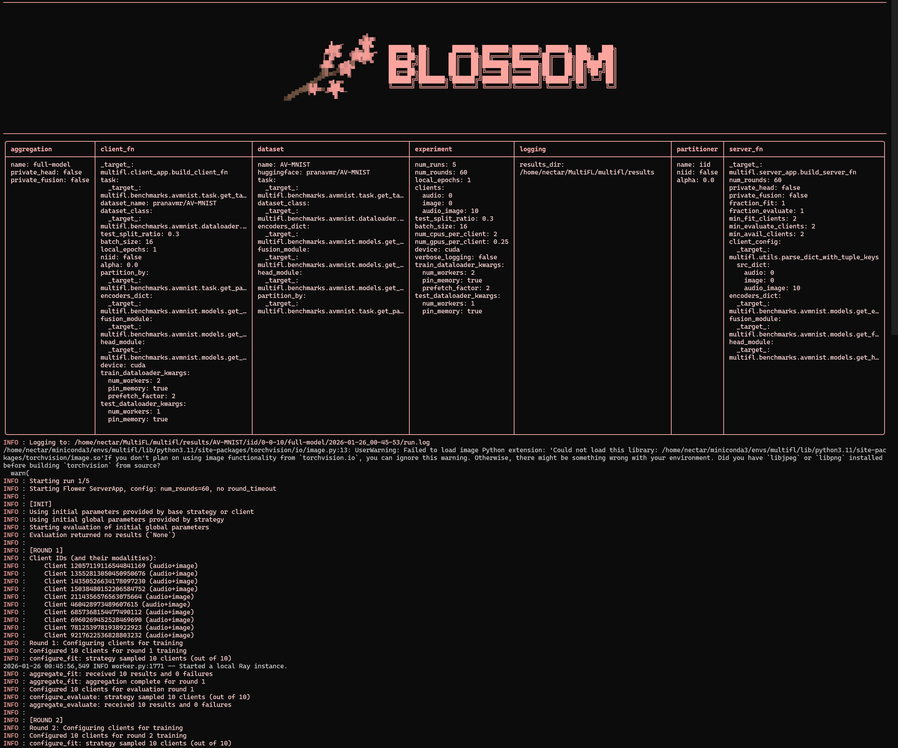

<div align="center">


<br/>

[](https://opensource.org/licenses/MIT)
[](https://www.python.org/downloads/)

</div>

---
# BLOSSOM : Block-wise Federated Learning Over Shared and Sparse Observed Modalities

**BLOSSOM** is a flexible framework that enables multimodal federated learning with real-world data scenarios. Built on the [Flower](https://github.com/adap/flower) framework, BLOSSOM implements the **MultiFL** strategy to handle heterogeneous client modalities, supporting various aggregation schemes including private heads and fusion layers.

## Features

- 🌸 **Multimodal Support**: Handle clients with different combinations of modalities (audio, text, image, etc.)
- 🔒 **Private Components**: Support for private heads and private fusion layers
- 📊 **Multiple Aggregation Strategies**: Full-model, private-head, and private-head-fusion aggregation
- 🎯 **Real-World Scenarios**: IID and Non-IID data partitioning
- 📈 **Rich Metrics**: Automatic plotting and CSV export of client-wise, modality-wise, and aggregated metrics
- ⚙️ **Hydra Configuration**: Flexible configuration management with composition and overrides

## Architecture

<div align="center">

</div>

BLOSSOM's architecture is designed to handle heterogeneous multimodal clients in a federated learning setting:

- **Modality-Specific Encoders**: Each modality (audio, text, image, sensor data, etc.) has its own encoder network that learns modality-specific representations
- **Fusion Module**: Combines representations from available modalities for each client, handling missing modalities gracefully
- **Task Head**: Performs the final prediction (classification, regression, etc.) based on the fused representation
- **Flexible Aggregation**: Supports multiple aggregation schemes:
  - **Full-model aggregation**: All parameters (encoders + fusion + head) are aggregated
  - **Private-head aggregation**: Only encoders and fusion are aggregated, heads remain private
  - **Private-head-fusion aggregation**: Only encoders are aggregated, fusion and heads remain private

This design enables clients with different modality combinations to participate in collaborative learning while preserving privacy through selective parameter aggregation.

## Installation

### Option 1: Using Conda + pip

```bash
# Create and activate conda environment
conda create -n blossom python=3.11
conda activate blossom

# Clone the repository
git clone https://github.com/DaSH-Lab-CSIS/BLOSSOM.git
cd blossom

# Install in editable mode
pip install -e .
```

### Option 2: Using uv

```bash
# Install uv if you haven't already
curl -LsSf https://astral.sh/uv/install.sh | sh

# Create and activate virtual environment
uv venv --python 3.11
source .venv/bin/activate  # On Windows: .venv\Scripts\activate

# Clone the repository
git clone https://github.com/DaSH-Lab-CSIS/BLOSSOM.git
cd blossom

# Install in editable mode
uv pip install -e .
```

### Option 3: Using pip only

```bash
# Create and activate virtual environment
python3.11 -m venv venv
source venv/bin/activate  # On Windows: venv\Scripts\activate

# Clone the repository
git clone https://github.com/DaSH-Lab-CSIS/BLOSSOM.git
cd blossom

# Install in editable mode
pip install -e .
```

## Quick Start

Run a basic experiment with default settings:

```bash
python -m blossom.main
```

This will run federated learning on the AV-MNIST dataset with IID partitioning and full-model aggregation.

## Configuration System

BLOSSOM uses [Hydra](https://github.com/facebookresearch/hydra) for hierarchical configuration management. The configuration is structured into composable components:

```
blossom/configs/
├── config.yaml              # Main configuration
├── dataset/                 # Dataset-specific configs
│   ├── avmnist.yaml
│   ├── iemocap.yaml
│   ├── kuhar.yaml
│   ├── meld.yaml
│   ├── ptbxl.yaml
│   ├── ucihar.yaml
│   └── ...
├── partitioner/             # Data partitioning configs
│   ├── iid.yaml
│   └── niid.yaml
└── aggregation/             # Aggregation strategy configs
    ├── full-model.yaml
    ├── private-head.yaml
    └── private-head-fusion.yaml
```

### Key Configuration Options

#### 1. **Dataset Selection**

Switch between datasets using the `dataset` override:

```bash
# AV-MNIST dataset (audio + image)
python -m blossom.main dataset=avmnist

# IEMOCAP dataset (audio + text)
python -m blossom.main dataset=iemocap

# KU-HAR dataset (accelerometer + gyroscope)
python -m blossom.main dataset=kuhar
```

#### 2. **Data Partitioning**

Control how data is distributed across clients:

```bash
# IID partitioning (default)
python -m blossom.main partitioner=iid

# Non-IID partitioning with Dirichlet distribution (alpha=0.5)
python -m blossom.main partitioner=niid

# Adjust alpha for stronger/weaker non-IID
python -m blossom.main partitioner=niid partitioner.alpha=0.1  # More non-IID
python -m blossom.main partitioner=niid partitioner.alpha=1.0  # Less non-IID
```

#### 3. **Aggregation Strategy**

Choose how model components are aggregated:

```bash
# Full-model aggregation (all parameters shared)
python -m blossom.main aggregation=full-model

# Private head (only encoders + fusion aggregated)
python -m blossom.main aggregation=private-head

# Private head + fusion (only encoders aggregated)
python -m blossom.main aggregation=private-head-fusion
```

#### 4. **Client Modality Distribution**

Specify how many clients have which modality combinations:

```bash
# 10 clients with both audio and image
python -m blossom.main dataset=avmnist \
    experiment.clients.audio_image=10

# 3 audio-only, 3 image-only, 4 with both
python -m blossom.main dataset=avmnist \
    experiment.clients.audio=3 \
    experiment.clients.image=3 \
    experiment.clients.audio_image=4

# 5 audio-only, 5 image-only, 0 with both
python -m blossom.main dataset=avmnist \
    experiment.clients.audio=5 \
    experiment.clients.image=5 \
    experiment.clients.audio_image=0
```

#### 5. **Training Hyperparameters**

Adjust training settings:

```bash
# More communication rounds and local epochs
python -m blossom.main \
    experiment.num_rounds=30 \
    experiment.local_epochs=5

# Larger batch size and more runs
python -m blossom.main \
    experiment.batch_size=64 \
    experiment.num_runs=30

# GPU configuration
python -m blossom.main \
    experiment.num_gpus_per_client=0.5 \
    experiment.num_cpus_per_client=2
```

### Complete Example Commands

#### Example 1: AV-MNIST with Non-IID data and private heads

```bash
python -m blossom.main \
    dataset=avmnist \
    partitioner=niid \
    partitioner.alpha=0.5 \
    aggregation=private-head \
    experiment.clients.audio=3 \
    experiment.clients.image=3 \
    experiment.clients.audio_image=4 \
    experiment.num_rounds=30 \
    experiment.local_epochs=2 \
    experiment.batch_size=16
```

#### Example 2: IEMOCAP with IID and full-model aggregation

```bash
python -m blossom.main \
    dataset=iemocap \
    partitioner=iid \
    aggregation=full-model \
    experiment.clients.audio=0 \
    experiment.clients.text=0 \
    experiment.clients.audio_text=10 \
    experiment.num_rounds=20 \
    experiment.num_runs=5
```

#### Example 3: Comparing all aggregation strategies

```bash
# Full-model
python -m blossom.main dataset=avmnist aggregation=full-model

# Private head
python -m blossom.main dataset=avmnist aggregation=private-head

# Private head + fusion
python -m blossom.main dataset=avmnist aggregation=private-head-fusion
```

## Output Structure

<div align="center">
  
  <p><i>Example CLI output showing the experiment configuration and training logs for a run</i></p>
</div>

Results are organized hierarchically:

```
results/
└── {dataset}/
    └── {partitioner}/
        └── {client_distribution}/
            └── {aggregation}/
                └── {timestamp}/
                    ├── run_1/
                    │   ├── aggregated_metrics.csv
                    │   ├── client_metrics.csv
                    │   ├── aggregated_*.png
                    │   ├── client_wise_*.png
                    │   └── modality_wise_*.png
                    ├── run_2/
                    │   └── ...
                    ├── aggregated_metrics.csv     # Averaged across runs
                    ├── averaged_*.png             # Plots averaged across runs
                    ├── modality_wise_*.png        # Modality comparison across runs
                    └── config.yaml                # Saved configuration
                    └── run.log                    # Saved logs
```

### Metrics and Plots

For each run, BLOSSOM generates:

1. **Aggregated Metrics**: Server-side averaged metrics (accuracy, loss)
2. **Client-wise Metrics**: Individual client performance over rounds
3. **Modality-wise Metrics**: Average performance grouped by modality combination

Plots include:
- Line plots with min/max/final annotations
- Color-coded by modality for easy comparison
- Automatic legend and grid styling

## Reproducibility

To ensure reproducibility of experiments, we provide pre-configured bash scripts for all benchmark datasets in the [`utils/`](utils/) folder:

- [`run_avmnist.sh`](utils/run_avmnist.sh) - AV-MNIST experiments (audio + image)
- [`run_iemocap.sh`](utils/run_iemocap.sh) - IEMOCAP experiments (audio + text)
- [`run_kuhar.sh`](utils/run_kuhar.sh) - KU-HAR experiments (accelerometer + gyroscope)
- [`run_meld.sh`](utils/run_meld.sh) - MELD experiments (audio + text)
- [`run_ptbxl.sh`](utils/run_ptbxl.sh) - PTB-XL experiments (ECG signals)
- [`run_ucihar.sh`](utils/run_ucihar.sh) - UCI-HAR experiments (accelerometer + gyroscope)

Each script contains the exact configurations used in our experiments, including:
- Client modality distributions (IID and Non-IID)
- Aggregation strategies (full-model, private-head, private-head-fusion)
- Hyperparameters (number of rounds, local epochs, batch sizes)

### Running Benchmark Experiments

To reproduce the results for any dataset:

```bash
# Make the script executable
chmod +x utils/run_avmnist.sh

# Run all experiments for a dataset
./utils/run_avmnist.sh
```

The scripts will automatically run all combinations of:
- Data partitioning strategies (IID, Non-IID)
- Client modality distributions
- Aggregation methods

Results will be saved in the `results/` directory with a structured hierarchy for easy comparison and analysis.

### Generating Comparison Plots

After running experiments, use the comparison plotting utility:

```bash
python utils/comparison_plot.py --dataset AVMNIST --partitioner iid
```

This will generate plots comparing different aggregation strategies and modality distributions across multiple runs.

## Setting Up a New Dataset

To add a new dataset to BLOSSOM, you'll need to create:

### 1. Dataset Configuration YAML

Create `blossom/configs/dataset/{your_dataset}.yaml`:

```yaml
# Configuration for YourDataset
name: YourDataset
huggingface: your-namespace/your-dataset
task:
  _target_: blossom.benchmarks.yourdataset.task.get_task
dataset_class:
  _target_: blossom.benchmarks.yourdataset.dataloader.get_dataset_class
encoders_dict:
  _target_: blossom.benchmarks.yourdataset.models.get_encoders_dict
fusion_module:
  _target_: blossom.benchmarks.yourdataset.models.get_fusion_module
head_module:
  _target_: blossom.benchmarks.yourdataset.models.get_head_module
partition_by:
  _target_: blossom.benchmarks.yourdataset.task.get_partition_by
```

### 2. Task Implementation

Create task.py by implementing the `Task` abstract class:

```python
class YourDatasetTask(Task):
    """Task implementation for YourDataset."""
    
    def __init__(
        self,
        criterion: nn.Module,
        input_modalities: list,
        output_key: str,
        **kwargs
    ):
        pass
    
    def prepare_batch(
        self,
        batch: Dict[str, Any],
        modalities: Tuple[str, ...],
        all_modalities: list,
        device: torch.device,
    ) -> Dict[str, torch.Tensor]:
        """Prepare batch data for model input."""
        pass
    
    def compute_loss(
        self,
        model: nn.Module,
        batch: Dict[str, torch.Tensor],
        device: torch.device,
    ) -> torch.Tensor:
        """Compute loss for a batch."""
        pass
    
    def compute_batch_metrics(
        self,
        model: nn.Module,
        batch: Dict[str, torch.Tensor],
        device: torch.device,
    ) -> Tuple[torch.Tensor, Dict[str, float]]:
        """Compute loss and metrics for a batch."""
        pass
    
    def compute_aggregated_metrics(
        self,
        accumulated_metrics: Dict[str, float],
        num_samples: int,
    ) -> Dict[str, float]:
        """Aggregate metrics over entire dataset."""
        pass

def get_task() -> Task:
    """Factory function to create task instance."""
    return YourDatasetTask(...)

def get_partition_by() -> str:
    """Return column name for data partitioning."""
    return "label"
```

### 3. Model Components

Create `blossom/benchmarks/yourdataset/models.py`:

```python
def get_encoders_dict() -> Dict[str, nn.Module]:
    """Build modality-specific encoders."""
    return {
        "modality1": YourModality1Encoder(),
        "modality2": YourModality2Encoder(),
    }

def get_fusion_module() -> nn.Module:
    """Build fusion module."""
    return YourFusionModule()

def get_head_module() -> nn.Module:
    """Build classification head."""
    return YourHeadModule()
```

### 4. Data Loader

Create `blossom/benchmarks/yourdataset/dataloader.py`:

```python
class YourDataset(MultimodalDataset):
    """Dataset wrapper for YourDataset."""
    
    def __init__(self, hf_dataset, is_train: bool = True):
        super().__init__(dataset, train_split)
    
    def __len__(self):
        return len(self.dataset)
    
    def __getitem__(self, idx: int) -> Dict[str, Any]:
        sample = self.dataset[idx]
        # Process and return sample
        return {
            "modality1": sample["modality1"],
            "modality2": sample["modality2"],
            "label": sample["label"],
        }

def get_dataset_class():
    """Return dataset class."""
    return YourDataset
```

### 5. Run Your Dataset

```bash
python -m blossom.main dataset=yourdataset
```

## Acknowledgments

The model implementations used in this project are adapted from the [FedMultimodal](https://github.com/usc-sail/fed-multimodal) repository.

## License

This project is licensed under the MIT License - see the LICENSE file for details.

## Contributing

Contributions are welcome! Please feel free to submit a Pull Request.

## Support

For questions and issues, please open an issue on GitHub.
